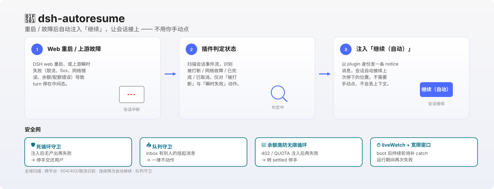

<p align="center">
  
</p>

<h1 align="center">dsh-autoresume</h1>

<p align="center">
  <strong>Auto-injects "continue" after a Web restart or upstream failure</strong> —— when a turn is left mid-flight, the plugin picks it up for you; no manual click.
</p>

<p align="center">
  <a href="https://github.com/shengyvself/dsh-autoresume/releases">
    
  </a>
  <a href="https://github.com/shengyvself/dsh-autoresume">
    
  </a>
  
  
  
</p>

<p align="center">
  <a href="./README.md">中文</a> · <strong>English</strong>
</p>

<p align="center">
  <a href="assets/hero.svg">
    
  </a>
</p>

## What you get

- 🔁 **Auto-resume on Web restart** —— after a dsh web restart, the plugin scans all sessions and picks up the interrupted ones; completed / settled / cancelled sessions are left alone.
- 🌐 **Transient upstream recovery** —— rate limits (429), 5xx, network errors (ECONNRESET / timeout), gateway 504, upstream provider faults —— the plugin injects "continue" and the turn retries automatically.
- 💳 **Quota / billing recognition** —— 402 / QUOTA / insufficient_balance / insufficient_quota: inject once (covers recovery after top-up), then go settled on repeat failure to prevent infinite loops.
- 🛡️ **Dead-loop guard** —— if the previous "continue" produced no content and the same error recurs, the plugin falls back to settled and hands control back to you.
- 📥 **Queue guard** —— if the inbox has someone else's pending message (user / client), the plugin does nothing at all (no inject, no resume), avoiding waking the user's message into the session.
- ⏱️ **liveWatch** —— keeps polling after boot to catch failures that recur **during** a run (previously only worked once per restart).
- 🔢 **Two-shot auto-continue** —— transient network failures (429 / rate limits) are allowed to inject → fail → inject again → fail → stop, suited to long rate-limit windows; quota failures stay one-shot.
- 🌍 **Cross-platform** —— Linux / macOS / Windows behave identically (`os.homedir()` + `node:path`, path separators auto-adapt).

## Install

```sh
dsh plugin --profile web add dsh-autoresume
```

After installing, **restart `dsh web`**. The plugin will scan and inject within the boot grace window (default 30 minutes, configurable via `bootGraceMs`).

**Requires DSH client packages >=0.1.0-rc.5.** Depends on `@deepseek-ai/dsh-agent` (reuses the DSH runtime copy, zero version drift).

You can also install directly from GitHub:

```sh
dsh plugin --profile web add github:shengyvself/dsh-autoresume
```

## What you can do with it

After installing, just use DSH normally — the plugin works in the background. Typical scenarios:

- "I just changed code and restarted dsh web" —— the plugin scans and picks up the interrupted dev session
- "The upstream model hit a rate limit" —— after 429 / rate_limit_exceeded, the plugin injects "continue" and the turn retries
- "That 504 gateway timeout earlier" —— gateway HTML error envelopes are recursively unwrapped, correctly judged as network failure, "continue" injected
- "Out of balance, just topped up" —— first 402 injects once (covers recovery after top-up), then settles automatically on repeat failure

The plugin never acts on its own; it only judges and injects on web restart or liveWatch poll.

## Compatibility

| Use case | DSH version | Plugin version |
|---|---|---|
| **Recommended** | **`0.1.5-rc.2+`** (currently maintained) | **`0.0.21`** |
| Minimum compatible | `0.1.0-rc.5+` | `0.0.21` |

Installing the plugin **does not** upgrade the host DSH. The `peerDependencies` declare a minimum client-package version of `>=0.1.0-rc.5`; verified working on `0.1.5-rc.2`.

## Configuration

| Key | Default | Description |
|---|---|---|
| `targetSessionId` | full scan | When set, only serve that session (compatibility mode) |
| `bootGraceMs` | `30000` (30 min) | Grace window after web boot for judging |
| `initialDelayMs` | `3000` | Initial check delay |
| `pollIntervalMs` | `5000` | Poll interval when session not ready |
| `promptText` | `继续（自动）` | Injected message body |
| `liveWatch` | `true` | Keep polling after boot to catch mid-run failures |
| `maxResumeAttempts` | `2` | Max consecutive auto-continue attempts for transient failures |
| `skipWhenInputPending` | `true` | Queue guard: skip injection if inbox has someone else's pending message |

## Security

- Reads session event streams only (`ctx.sessionPersistence`); **never writes** user files.
- Injected messages are sent as plugin identity (`source.kind=plugin, form=notice`), never disguised as user messages.
- No network calls. Except for calling DSH's internal `ctx.agents.get()` / `agent.followup()`, there are no outbound requests.
- Triple protection: dead-loop guard + quota infinite-loop guard + queue guard, to avoid false positives.

## Dependency notes

`@deepseek-ai/dsh-agent` is declared in `peerDependencies` (provided by the host DSH).

⚠️ Known issue: `package.json`'s `dependencies` also lists `@deepseek-ai/dsh-agent: 0.1.1-rc.2` —— this violates the persona §三.1.3 rule (official `@deepseek-ai/*` packages go only to peerDependencies). The current install path is a manual symlink reusing the DSH runtime copy, avoiding version drift. Will be cleaned up in the next release.

## Version history

Full changelog: [`CHANGELOG.md`](./CHANGELOG.md). Key milestones:

- **v0.0.21** (2026-09-13): Auto-resume chain fix (0.1.5 `inspect()` removed → `open/read/close`; `AgentSetup` callback signature change)
- **v0.0.19** (2026-09-13): Queue guard + DSH 0.1.5 session generation adaptation
- **v0.0.18** (2026-09-08): Two-shot auto-continue (SenseNova decision)
- **v0.0.17** (2026-09-02): tpm/rpm rate-limit recognition
- **v0.0.16** (2026-09-01): Startup crash fix (defensive `getAgent()`)
- **v0.0.15** (2026-09-01): 402/400/Chinese transient recovery + quota infinite-loop guard
- **v0.0.13** (2026-08-31): OpenRouter upstream provider fault recognition
- **v0.0.12** (2026-08-31): 504/gateway timeout recursive envelope unwrap
- **v0.0.9** (2026-08-24): liveWatch + dead-loop guard
- **v0.0.8** (2026-08-24): Network-failure stop recognition

## Build & development

```bash
npm run build
npm test
```

## License

[Apache License 2.0](./LICENSE) © shengyvself
